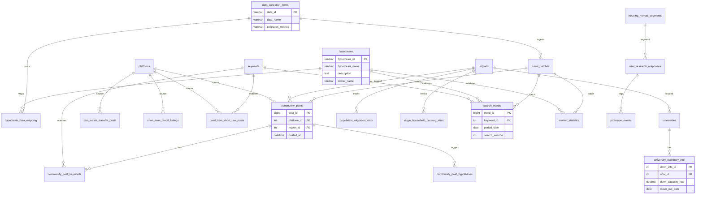

# 팝콘 프로젝트 데이터 모델

> **Database:** `popcorn_dw`  
> **목적:** 시즌성 주거 노마드 가설(H1~H6) 검증을 위한 데이터 수집·분석 웨어하우스

---

## 1. 모델링 설계 원칙

| 원칙 | 적용 |
|------|------|
| **3-Layer Architecture** | Master(참조) → Fact(수집) → View(분석) |
| **정규화** | 플랫폼·키워드·지역·가설을 마스터로 분리, M:N은 브릿지 테이블 |
| **ETL Lineage** | 모든 Fact 테이블에 `batch_id` FK → 수집 이력 추적 |
| **가설 중심** | `hypotheses` ↔ `data_collection_items` ↔ Fact 테이블 연결 |
| **중복 통합** | D001(커뮤니티), D003(검색), D010(렌탈) 등 8건 통합 반영 |

---

## 2. ERD (Entity Relationship Diagram)



---

## 3. 테이블 레이어 구조

### Layer 1 — Master (9 tables)

| 테이블 | 역할 |
|--------|------|
| `hypotheses` | 검증 가설 H1~H6 |
| `data_collection_items` | 수집 항목 D001~D020 |
| `hypothesis_data_mapping` | 가설 ↔ 데이터 M:N |
| `platforms` | 수집 플랫폼 (에타, 당근, 다방 등) |
| `keywords` | 크롤링/검색 키워드 |
| `regions` | 행정동 지역 마스터 |
| `universities` | 대학 마스터 |
| `housing_nomad_segments` | 세그먼트 정의 (리턴족, 기숙사생 등) |
| `crawl_batches` | ETL 수집 배치 이력 |

### Layer 2 — Fact (14 tables)

| 테이블 | 데이터 ID | 관련 가설 | 설명 |
|--------|-----------|----------|------|
| `community_posts` | D001 | H1,H3,H6 | 커뮤니티 크롤링 통합 |
| `community_post_keywords` | D001 | - | 게시글-키워드 M:N |
| `community_post_hypotheses` | D001 | - | 게시글-가설 태깅 |
| `real_estate_transfer_posts` | D002 | H1 | 방양도 게시글 |
| `search_trends` | D003 | H1,H3,H5,H6 | 검색량 시계열 |
| `university_dormitory_info` | D004 | H1,H3,H6 | 기숙사 공시 |
| `youth_housing_contracts` | D005 | H1 | 청년 계약유지기간 |
| `competitor_storage_services` | D006 | H1 | 경쟁사 창고 |
| `alternative_cost_benchmarks` | D007 | H1,H6 | 택배/용달 비용 |
| `market_statistics` | D008~D011 | H2,H3,H5 | 시장 통계 통합 |
| `short_term_rental_listings` | D012,D014 | H3,H6 | 단기임대 매물 |
| `population_migration_stats` | D013 | H3,H6 | 인구이동 |
| `single_household_housing_stats` | D019 | H6 | 1인가구 주거 |
| `used_item_short_use_posts` | D018 | H5 | 중고 단기사용 |
| `user_research_responses` | D015 | H4 | 설문 응답 |
| `prototype_events` | D017 | H4 | 프로토타입 행동 |
| `competitor_trust_benchmarks` | D016 | H4 | 빌릿지 벤치마킹 |

### Layer 3 — Views (5 views)

| View | 용도 |
|------|------|
| `v_h1_community_pain_trend` | H1: 방학 시즌 커뮤니티 페인 급증 |
| `v_h1_room_transfer_trend` | H1: 방양도 시즌별 추이·매칭률 |
| `v_h3_cost_comparison` | H3: 단기월세 vs 보관비용 비교 |
| `v_h6_dorm_gap_market_size` | H6: 기숙사 퇴소 × 1인가구 밀집 |
| `v_data_collection_status` | 수집 현황 대시보드 |
| `v_search_seasonality` | 검색 트렌드 시즌성 |

---

## 4. 가설별 데이터 흐름

```
[H1 페인포인트]
  대학알리미(퇴소규정) → university_dormitory_info
  에타/당근(짐/월세)   → community_posts + keywords
  다방(방양도)         → real_estate_transfer_posts
  데이터랩(검색량)     → search_trends
  다락(경쟁사)         → competitor_storage_services
  우체국(택배비)       → alternative_cost_benchmarks

[H2 위탁대여 관심]
  KOSIS/리서치         → market_statistics (sharing_economy, used_trade, rental)

[H3 지불의향]
  직방/다방(단기월세)  → short_term_rental_listings
  통계청(인구이동)     → population_migration_stats

[H4 위탁신뢰]
  설문                 → user_research_responses
  빌릿지               → competitor_trust_benchmarks
  프로토타입           → prototype_events

[H5 외부대여]
  당근/중고나라        → used_item_short_use_posts
  데이터랩(렌탈)       → search_trends

[H6 메인타겟]
  기숙사+1인가구+이동  → v_h6_dorm_gap_market_size (View 조인)
```

---

## 5. DDL 적용 방법

```bash
# MySQL 접속 후 순서대로 실행
mysql -u root -p < database/schema/00_create_database.sql
mysql -u root -p < database/schema/01_master_tables.sql
mysql -u root -p < database/schema/02_fact_tables.sql
mysql -u root -p < database/schema/03_views.sql
mysql -u root -p < database/seed/seed_master.sql
```

또는 Windows PowerShell:

```powershell
Get-Content database\schema\00_create_database.sql, database\schema\01_master_tables.sql, database\schema\02_fact_tables.sql, database\schema\03_views.sql, database\seed\seed_master.sql | mysql -u root -p
```

---

## 6. 핵심 관계 요약

| 관계 | Cardinality | FK |
|------|-------------|-----|
| hypotheses ↔ data_collection_items | M:N | `hypothesis_data_mapping` |
| community_posts ↔ keywords | M:N | `community_post_keywords` |
| community_posts ↔ hypotheses | M:N | `community_post_hypotheses` |
| regions → fact tables | 1:N | `region_id` |
| platforms → fact tables | 1:N | `platform_id` |
| crawl_batches → fact tables | 1:N | `batch_id` |
| universities → dormitory_info | 1:N | `univ_id` |
